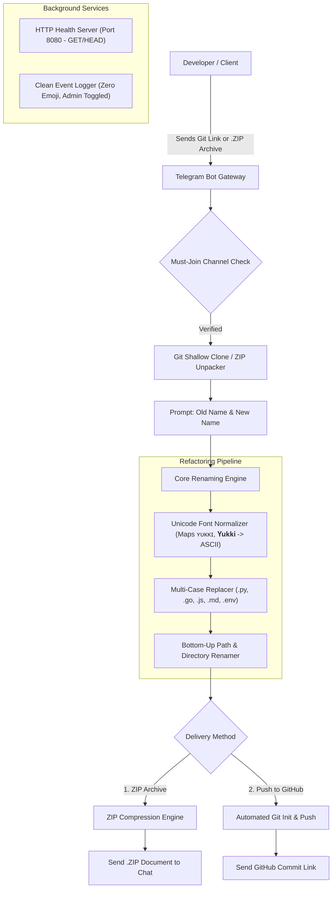

# ⚡ 𝗠𝗢𝗗𝗨𝗟𝗘 𝗥𝗘𝗡𝗔𝗠𝗘𝗥 𝗕𝗢𝗧 (𝗚𝗢𝗟𝗔𝗡𝗚)

### 🚀 𝗨𝗻𝗶𝘃𝗲𝗿𝘀𝗮𝗹 𝗖𝗼𝗱𝗲𝗯𝗮𝘀𝗲 𝗥𝗲𝗳𝗮𝗰𝘁𝗼𝗿𝗶𝗻𝗴, 𝗨𝗻𝗶𝗰𝗼𝗱𝗲 𝗙𝗼𝗻𝘁 𝗠𝗮𝘁𝗰𝗵𝗶𝗻𝗴 & 𝗚𝗶𝘁𝗛𝘂𝗯 𝗗𝗲𝗽𝗹𝗼𝘆𝗺𝗲𝗻𝘁 𝗘𝗻𝗴𝗶𝗻𝗲

  

  
  
  
  

  
  
  
  
  

---

## 🎯 𝗪𝗵𝗮𝘁 𝗶𝘀 𝗠𝗼𝗱𝘂𝗹𝗲 𝗥𝗲𝗻𝗮𝗺𝗲𝗥 𝗕𝗼𝘁?

**𝗠𝗼𝗱𝘂𝗹𝗲 𝗥𝗲𝗻𝗮𝗺𝗲𝗿 𝗕𝗼𝘁** is an enterprise-grade codebase refactoring and rebranding microservice written in **Golang**. It automates project-wide renaming across Python, Go, JavaScript, TypeScript, Rust, C++, Java, Shell, and configuration files.

It includes an **in-memory and MongoDB storage engine**, a built-in **GET & HEAD Health Server** for cloud uptime pinging, **Unicode stylized font normalizer** (`ʏᴜᴋᴋɪ`, `𝐘𝐮𝐤𝐤𝐢`, `𝒀𝒖𝒌𝒌𝒊`), **clean professional zero-emoji event logging**, and **dual delivery pipelines** (Direct Telegram ZIP Document vs Direct GitHub Push).

⚡ **Sub-Second Execution** &bull; 🔡 **Unicode Font Recognition** &bull; 🛡️ **Clean Professional Logs**

## 🏗️ 𝗦𝘆𝘀𝘁𝗲𝗺 𝗔𝗿𝗰𝗵𝗶𝘁𝗲𝗰𝘁𝘂𝗿𝗲

## ☁️ 𝗢𝗻𝗲-𝗖𝗹𝗶𝗰𝗸 𝗖𝗹𝗼𝘂𝗱 𝗗𝗲𝗽𝗹𝗼𝘆𝗺𝗲𝗻𝘁

Deploy instantly to your preferred cloud platform using the one-click templates:

  
  &nbsp;
  
  &nbsp;
  
  &nbsp;
  

---

## ✨ 𝗙𝗲𝗮𝘁𝘂𝗿𝗲𝘀

<table>
<tr>
<td>

### 🔡 𝗨𝗻𝗶𝗰𝗼𝗱𝗲 & 𝗙𝗮𝗻𝗰𝘆 𝗙𝗼𝗻𝘁 𝗠𝗮𝘁𝗰𝗵𝗶𝗻𝗴
- Normalizes mathematical bold, small capitals, and stylized homoglyphs
- Detects words written in fancy fonts (e.g. `ʏᴜᴋᴋɪ`, `𝐘𝐮𝐤𝐤𝐢`, `𝒀𝒖𝒌𝒌𝒊`)
- Accurately converts or stylizes responses using aesthetic fonts (`𝐒υᴘᴘσꝛᴛ`, `𝐇ᴇʟᴘ`, `𝐎ᴡɴᴇꝛ`, `𝐑ᴇᴘσ`)
- Prevents broken characters during code file replacement

</td>
<td>

### 🌐 𝗕𝘂𝗶𝗹𝘁-𝗶𝗻 𝗛𝗧𝗧𝗣 𝗛𝗲𝗮𝗹𝘁𝗵 𝗦𝗲𝗿𝘃𝗲𝗿
- Responds to both `GET` and `HEAD` requests on `/`, `/health`, and `/ping`
- Keeps cloud instances alive on Render, Koyeb, Railway, and Heroku
- Returns JSON uptime payload: `{"status":"ok","service":"module-renamer-bot"}`
- Zero additional setup required

</td>
</tr>
<tr>
<td>

### 📋 𝗖𝗹𝗲𝗮𝗻 𝗘𝘃𝗲𝗻𝘁 𝗟𝗼𝗴𝗴𝗲𝗿 (𝗭𝗲𝗿𝗼 𝗘𝗺𝗼𝗷𝗶)
- Captures who started the bot, target repositories, and replacement terms
- Strictly clean, professional format without emojis:
  `[2026-10-09 09:30:00] [INFO] USER_START: UserID=... Username=...`
- Admin toggleable via `/log on` and `/log off` or control panel
- Optional real-time forwarding to `LOG_CHANNEL`

</td>
<td>

### 👑 𝗦𝘂𝗱𝗼 𝗔𝗱𝗺𝗶𝗻 𝗗𝗮𝘀𝗵𝗯𝗼𝗮𝗿𝗱
- Admin controls strictly visible to authorized Sudo users only
- Global user blacklist system (`/gban` and `/ungban`)
- Real-time broadcast engine (`/broadcast`) with rate-limit delays
- Live hardware telemetry (`/stats`): RAM, CPU, Goroutines, user counts

</td>
</tr>
</table>

## 🤖 𝗕𝗼𝘁 𝗖𝗼𝗺𝗺𝗮𝗻𝗱𝘀 𝗥𝗲𝗳𝗲𝗿𝗲𝗻𝗰𝗲

### 👤 𝗨𝘀𝗲𝗿 𝗖𝗼𝗺𝗺𝗮𝗻𝗱𝘀
| Command | Description |
| :--- | :--- |
| `/start` | Launch the bot, verify channel membership, and view aesthetic menu |
| `/rename` | Initiate a new project rebranding session |
| `/cancel` | Abort any ongoing renaming operation and purge temporary files |
| `/help` | Multi-page guide with `⬅️ 𝐁ᴀᴄᴋ` and `𝐍ᴇxᴛ ➡️` pagination |

### 👑 𝗦𝘂𝗱𝗼 / 𝗔𝗱𝗺𝗶𝗻 𝗖𝗼𝗺𝗺𝗮𝗻𝗱𝘀 (𝗥𝗲𝘀𝘁𝗿𝗶𝗰𝘁𝗲𝗱)
| Command | Description |
| :--- | :--- |
| `/admin` or `/panel` | Interactive Sudo Management Console with live telemetry |
| `/stats` | Instant server telemetry (RAM allocated, Go runtime, active users) |
| `/log on` / `/log off` | Enable or disable clean event logging |
| `/broadcast <msg>` | Broadcast text or media message to all stored bot users |
| `/gban <id> [reason]` | Globally ban a user from interacting with the bot |
| `/ungban <id>` | Unban a blacklisted user |
| `/users` | Return total registered user count from database |

## ⚙️ 𝗘𝗻𝘃𝗶𝗿𝗼𝗻𝗺𝗲𝗻𝘁 𝗖𝗼𝗻𝗳𝗶𝗴𝘂𝗿𝗮𝘁𝗶𝗼𝗻

| Variable | Required | Description | Example |
| :--- | :---: | :--- | :--- |
| `BOT_TOKEN` | Yes (for Bot) | Telegram Bot Token from [@BotFather](https://t.me/BotFather) | `123456:ABC-DEF...` |
| `OWNER_ID` | Yes | Numeric User ID of bot owner | `123456789` |
| `OWNER_USERNAME` | Optional | Telegram username of owner (without @) | `SUDEEPBOTS` |
| `REPO_URL` | Optional | Link to source repository | `https://github.com/SUDEEPBOTS/module-renamer-bot` |
| `SUPPORT_CHAT` | Optional | Support group/channel username | `SUDEEPBOTS` |
| `MONGO_URI` | Optional | MongoDB URI (falls back to In-Memory DB if omitted) | `mongodb+srv://...` |
| `SUDO_USERS` | Optional | Additional Sudo user IDs separated by comma | `987654321,11223344` |
| `FSUB_CHANNEL` | Optional | Force-Subscribe Telegram channel username | `SUDEEPBOTS` |
| `LOG_CHANNEL` | Optional | Telegram channel ID to receive audit logs | `-1001234567890` |
| `GITHUB_TOKEN` | Optional | Default Personal Access Token for auto GitHub pushes | `ghp_...` |
| `PORT` | Optional | Port for the built-in HTTP health check server | `8080` |

## 📜 𝗟𝗶𝗰𝗲𝗻𝘀𝗲

Distributed under the MIT License. See [LICENSE](LICENSE) for more information.

---

### ⭐ 𝗦𝘁𝗮𝗿 𝘁𝗵𝗶𝘀 𝗿𝗲𝗽𝗼 𝗶𝗳 𝘆𝗼𝘂 𝗳𝗼𝘂𝗻𝗱 𝗶𝘁 𝘂𝘀𝗲𝗳𝘂𝗹!

  

