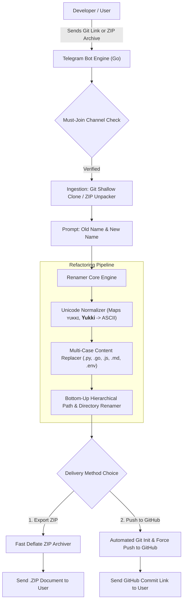

<div align="center">


# ⚡ 𝗠𝗢𝗗𝗨𝗟𝗘 𝗥𝗘𝗡𝗔𝗠𝗘𝗥 𝗕𝗢𝗧 (𝗚𝗢𝗟𝗔𝗡𝗚)

### 🚀 𝗨𝗻𝗶𝘃𝗲𝗿𝘀𝗮𝗹 𝗖𝗼𝗱𝗲𝗯𝗮𝘀𝗲 𝗥𝗲𝗳𝗮𝗰𝘁𝗼𝗿𝗶𝗻𝗴, 𝗨𝗻𝗶𝗰𝗼𝗱𝗲 𝗙𝗼𝗻𝘁 𝗠𝗮𝘁𝗰𝗵𝗶𝗻𝗴 & 𝗚𝗶𝘁𝗛𝘂𝗯 𝗗𝗲𝗽𝗹𝗼𝘆𝗺𝗲𝗻𝘁 𝗘𝗻𝗴𝗶𝗻𝗲

<p>
  
</p>

<p>
  
  
  
  
  
</p>

---


</div>

## 🎯 𝗪𝗵𝗮𝘁 𝗶𝘀 𝗠𝗼𝗱𝘂𝗹𝗲 𝗥𝗲𝗻𝗮𝗺𝗲𝗿 𝗕𝗼𝘁?

**𝗠𝗼𝗱𝘂𝗹𝗲 𝗥𝗲𝗻𝗮𝗺𝗲𝗿 𝗕𝗼𝘁** is an enterprise-grade refactoring microservice engineered in **Golang**. It automates codebase rebranding across multiple programming languages (Python, Go, JavaScript, TypeScript, Rust, C++, Java, Shell, and configuration files).

It solves the common pain point of manual code renaming by performing multi-case adaptation (`UPPERCASE`, `lowercase`, `TitleCase`), **Unicode stylized font normalization** (matching `ʏᴜᴋᴋɪ`, `𝐘𝐮𝐤𝐤𝐢`, `𝒀𝒖𝒌𝒌𝒊`, `𝐒υᴘᴘσꝛᴛ`), **bottom-up directory renaming**, and delivering the result via **Telegram ZIP download** or **automated GitHub repository push**.

⚡ **Sub-Second Execution** &bull; 🔡 **Unicode Font Recognition** &bull; 📦 **Direct ZIP or GitHub Push**

<div align="center">

</div>

## 🏗️ 𝗦𝘆𝘀𝘁𝗲𝗺 𝗔𝗿𝗰𝗵𝗶𝘁𝗲𝗰𝘁𝘂𝗿𝗲



<div align="center">

</div>

## ✨ 𝗙𝗲𝗮𝘁𝘂𝗿𝗲𝘀

<table>
<tr>
<td>

### 🔡 𝗨𝗻𝗶𝗰𝗼𝗱𝗲 & 𝗙𝗮𝗻𝗰𝘆 𝗙𝗼𝗻𝘁 𝗠𝗮𝘁𝗰𝗵𝗶𝗻𝗴
- Normalizes mathematical bold, small capitals, and stylized homoglyphs
- Detects words written in fancy fonts (e.g. `ʏᴜᴋᴋɪ`, `𝐘𝐮𝐤𝐤𝐢`, `𝒀𝒖𝒌𝒌𝒊`)
- Accurately converts or stylizes responses using aesthetic fonts (`𝐒υᴘᴘσꝛᴛ`, `𝐇𝐞𝐥𝐩`)
- Prevents broken characters during code file replacement

</td>
<td>

### 📁 𝗕𝗼𝘁𝘁𝗼𝗺-𝗨𝗽 𝗣𝗮𝘁𝗵 𝗥𝗲𝘀𝘁𝗿𝘂𝗰𝘁𝘂𝗿𝗶𝗻𝗴
- Deepest-first directory traversal prevents invalid path references
- Renames packages, modules, filenames, and folder structures
- Skips binary media (`.png`, `.jpg`, `.mp3`, `.mp4`) and binary blobs
- Automatic exclusion of `.git/`, `.venv/`, `node_modules/`, `__pycache__/`

</td>
</tr>
<tr>
<td>

### 🚀 𝗧𝘄𝗼 𝗗𝗲𝗹𝗶𝘃𝗲𝗿𝘆 𝗠𝗼𝗱𝗲𝘀
- **📦 Direct ZIP Download:** Generates compressed `.zip` and uploads to chat
- **🚀 Push to GitHub:** Automatically initializes a fresh Git branch and pushes cleanly to user's target repository
- Zero manual Git commands required

</td>
<td>

### 👑 𝗦𝘂𝗱𝗼 𝗔𝗱𝗺𝗶𝗻 𝗗𝗮𝘀𝗵𝗯𝗼𝗮𝗿𝗱
- Admin controls strictly visible to authorized Sudo users only
- Global user blacklist system (`/gban` and `/ungban`)
- Real-time broadcast engine (`/broadcast`) with rate-limit delays
- Live hardware telemetry (`/stats`): RAM, CPU, Goroutines, user counts

</td>
</tr>
</table>

<div align="center">

</div>

## 🤖 𝗕𝗼𝘁 𝗖𝗼𝗺𝗺𝗮𝗻𝗱𝘀 𝗥𝗲𝗳𝗲𝗿𝗲𝗻𝗰𝗲

### 👤 𝗨𝘀𝗲𝗿 𝗖𝗼𝗺𝗺𝗮𝗻𝗱𝘀
| Command | Description |
| :--- | :--- |
| `/start` | Launch the bot, verify channel membership, and view main menu |
| `/rename` | Initiate a new project rebranding session |
| `/cancel` | Abort any ongoing renaming operation and purge temporary files |
| `/help` | Detailed guide on providing repository links and replace terms |

### 👑 𝗦𝘂𝗱𝗼 / 𝗔𝗱𝗺𝗶𝗻 𝗖𝗼𝗺𝗺𝗮𝗻𝗱𝘀 (𝗥𝗲𝘀𝘁𝗿𝗶𝗰𝘁𝗲𝗱)
| Command | Description |
| :--- | :--- |
| `/admin` or `/panel` | Interactive Sudo Management Console with live telemetry |
| `/stats` | Instant server telemetry (RAM allocated, Go runtime, active users) |
| `/broadcast <msg>` | Broadcast text or media message to all stored bot users |
| `/gban <id> [reason]` | Globally ban a user from interacting with the bot |
| `/ungban <id>` | Unban a blacklisted user |
| `/users` | Return total registered user count from database |

<div align="center">

</div>

## 🚀 𝗤𝘂𝗶𝗰𝗸 𝗦𝘁𝗮𝗿𝘁 & 𝗗𝗲𝗽𝗹𝗼𝘆𝗺𝗲𝗻𝘁

### ⚡ 𝗢𝗽𝘁𝗶𝗼𝗻 𝟭: 𝗦𝘁𝗮𝗻𝗱𝗮𝗹𝗼𝗻𝗲 𝗟𝗼𝗰𝗮𝗹 𝗖𝗟𝗜 𝗠𝗼𝗱𝗲
You can run the engine directly from terminal without a bot token:

```bash
# Clone the repository
git clone https://github.com/SUDEEPBOTS/module-renamer-bot.git
cd module-renamer-bot

# Run instant CLI renaming on any directory
go run cmd/bot/main.go -dir /path/to/my-repo -old Yukki -new Pulse
```

### 🤖 𝗢𝗽𝘁𝗶𝗼𝗻 𝟮: 𝗧𝗲𝗹𝗲𝗴𝗿𝗮𝗺 𝗕𝗼𝘁 (𝗚𝗼 𝗡𝗮𝘁𝗶𝘃𝗲)

```bash
# 1. Clone repository
git clone https://github.com/SUDEEPBOTS/module-renamer-bot.git
cd module-renamer-bot

# 2. Configure environment
cp sample.env .env
nano .env   # Add BOT_TOKEN, OWNER_ID, etc.

# 3. Build & Run
go build -o bin/module-renamer-bot cmd/bot/main.go
./bin/module-renamer-bot
```

### 🐳 𝗢𝗽𝘁𝗶𝗼𝗻 𝟯: 𝗗𝗼𝗰𝗸𝗲𝗿 𝗖𝗼𝗺𝗽𝗼𝘀𝗲

```bash
# Configure .env
cp sample.env .env

# Launch container
docker compose up -d --build
```

<div align="center">

</div>

## ⚙️ 𝗘𝗻𝘃𝗶𝗿𝗼𝗻𝗺𝗲𝗻𝘁 𝗖𝗼𝗻𝗳𝗶𝗴𝘂𝗿𝗮𝘁𝗶𝗼𝗻

| Variable | Required | Description | Example |
| :--- | :---: | :--- | :--- |
| `BOT_TOKEN` | Yes (for Bot) | Telegram Bot Token from [@BotFather](https://t.me/BotFather) | `123456:ABC-DEF...` |
| `OWNER_ID` | Yes | Numeric User ID of bot owner | `123456789` |
| `MONGO_URI` | Optional | MongoDB URI (falls back to In-Memory DB if omitted) | `mongodb+srv://...` |
| `SUDO_USERS` | Optional | Additional Sudo user IDs separated by comma | `987654321,11223344` |
| `FSUB_CHANNEL` | Optional | Force-Subscribe Telegram channel username | `SUDEEPBOTS` |
| `GITHUB_TOKEN` | Optional | Default Personal Access Token for auto GitHub pushes | `ghp_...` |
| `WORK_DIR` | Optional | Local temp directory for processing repos | `/tmp/renamer_work` |

<div align="center">

</div>

## 📜 𝗟𝗶𝗰𝗲𝗻𝘀𝗲

Distributed under the MIT License. See [LICENSE](LICENSE) for more information.

---

<div align="center">

### ⭐ 𝗦𝘁𝗮𝗿 𝘁𝗵𝗶𝘀 𝗿𝗲𝗽𝗼 𝗶𝗳 𝘆𝗼𝘂 𝗳𝗼𝘂𝗻𝗱 𝗶𝘁 𝘂𝘀𝗲𝗳𝘂𝗹!

<p>
  
</p>

<a href="https://github.com/SUDEEPBOTS">
  
</a>
<a href="https://t.me/SUDEEPBOTS">
  
</a>

</div>
